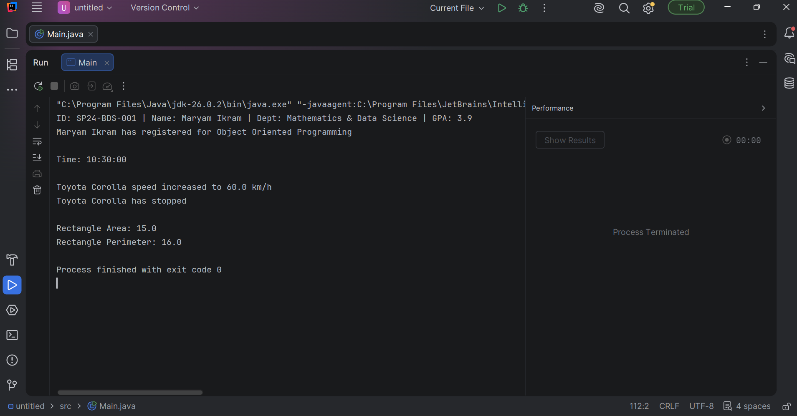
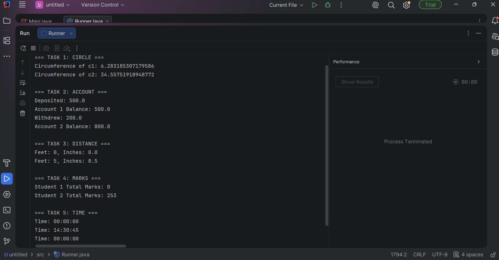

<div align="center">
  

  <h3><b>COMSATS University Islamabad, Lahore Campus</b></h3>
  <p><b>Department of Mathematics & Data Science</b> | Object-Oriented Programming (Java)</p>

  <p>
    
    
    
  </p>
</div>

---

###  Student Information

<table width="100%">
  <tr>
    <td width="30%" align="center">
      
    </td>
    <td width="70%">
      <b>Program:</b> BS Mathematics & Data Science<br/>
      <b>Course:</b> Object-Oriented Programming (CSC241)<br/>
      <b>Platform:</b> Java Standard Edition
    </td>
  </tr>
</table>

---

###  Lab Work Repository Index

####  Lab Task 01 (`Main.java`)
> **Focus:** Object Analysis, Classes, State & Behavior Implementation

| Task | Target Class | Data Members | Key Methods |
| :---: | :--- | :--- | :--- |
| **01** | `Student` | `studentID`, `name`, `department`, `gpa` | `registerCourse()`, `displayInfo()` |
| **02** | `Time` | `hours`, `minutes`, `seconds` | `setTime()`, `displayTime()` |
| **03** | `Car` | `brand`, `model`, `year`, `speed` | `accelerate()`, `brake()` |
| **04** | `Rectangle` | `length`, `width` | `calculateArea()`, `calculatePerimeter()` |

####  Execution Output Preview

<div align="center">
  
</div>

<br/>

####  Lab Task 02 (`Lab_Task_02.java`)
> **Focus:** Constructors (Default & Parameterized), Input Validation & Runner Execution

| Task | Target Class | Data Members | Key Methods |
| :---: | :--- | :--- | :--- |
| **01** | `Circle` | `radius` | `calculateCircumference()` |
| **02** | `Account` | `balance` | `deposit()`, `withdraw()` |
| **03** | `Distance` | `feet`, `inches` | `display()` |
| **04** | `Marks` | `mark1`, `mark2`, `mark3` | `calculateSum()` |
| **05** | `Time` | `hr`, `min`, `seconds` | `display()` |

####  Execution Output Preview

<div align="center">
  
</div>

---

###  Execution Guide

Run using the standard Java compiler (`javac`) in your terminal or IDE (IntelliJ, Eclipse, NetBeans):

```bash
# Compile and run Lab Task 1
javac Main.java
java Main

# Compile and run Lab Task 2
javac Lab_Task_02.java
java Runner
